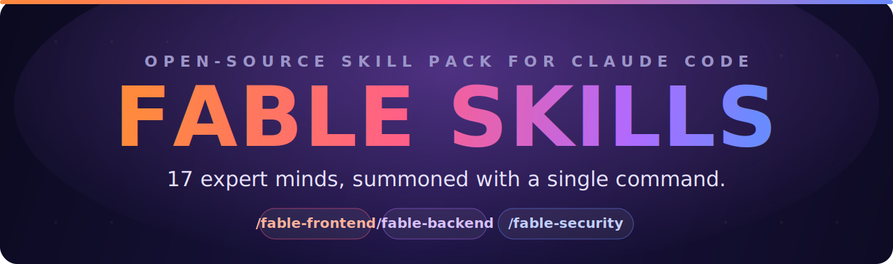

<div align="center">



<br/>

<p>
  <a href="#-installation"></a>
  <a href="#-the-skill-arsenal"></a>
  <a href="#-license"></a>
  <a href="#-contributing"></a>
</p>

<p>
  
  
  
  
  
</p>

### **Summon a world-class specialist into your coding session — with one command.**

```bash
npx fable-skills add all
```

`/fable-frontend` · `/fable-backend` · `/fable-security` · `/fable-database` · `/fable-aiml` … *and 12 more*

</div>

---

## ✨ What is Fable Skills?

**Fable Skills is an open-source pack of 17 expert "minds" for [Claude Code](https://claude.com/claude-code).**

Each skill is a single, dense `SKILL.md` that encodes how a *world-class specialist in one domain actually thinks* — their intake protocol, their mental models, the traps they've learned to avoid, and the way they reason through real problems. Drop them into Claude Code and, when your task matches a domain, the relevant expert takes the wheel.

> You don't get a chatbot that "knows about" databases. You get the engineer who **feels physical discomfort** when they see a sequential scan on a 10-million-row table — and refactors it before it pages someone at 2 AM.

Every skill is built on one shared identity layer — **Fable** — a single standard of thinking: precise, warm, production-minded, and proactive. The skills are the expertise; Fable is the discipline that runs through all of them.

---

## ⚡ Quick Install

```bash
npx fable-skills add all
```

That's it. All 17 skills + the Fable identity layer land in `~/.claude/` — no cloning, no file copying. Open Claude Code and type `/fable-` to confirm.

Install selectively:

```bash
npx fable-skills add security          # one skill
npx fable-skills add backend database  # a few
npx fable-skills list                  # see what's available
npx fable-skills remove seo            # uninstall one
```

Requires Node.js ≥ 16. Works on macOS, Linux, and Windows.

---

## 🎯 Why it's different

<table>
<tr>
<td width="50%" valign="top">

### 🧠 Real expertise, not vibes
Each skill is hard-won domain reasoning — *"is this a prompt, context, retrieval, or model problem?"* — not a list of buzzwords. Written the way a staff engineer would brief a sharp colleague.

</td>
<td width="50%" valign="top">

### ⚡ Token-efficient by design
Every skill loads **once per session**, then works from memory. No re-reading the same file every turn. Dense, no filler — every sentence does a job.

</td>
</tr>
<tr>
<td width="50%" valign="top">

### 🏭 Production mindset, always
Designed for the moment things fail under real load — the migration that locks the table, the prompt that breaks on adversarial input, the query slow at 100× volume.

</td>
<td width="50%" valign="top">

### 🔗 Skills that stack
Real tasks cross boundaries — so every skill carries an explicit map of *when to pull in a sibling*: backend reaches for `database` at a schema wall, copy reaches for `design` on layout, security reaches for `aiml` on prompt injection. Synthesized, not siloed.

</td>
</tr>
<tr>
<td width="50%" valign="top">

### 🔍 Proactive intelligence
Surfaces the problem you didn't name: the missing index, the IDOR, the scope creep, the copy that won't convert — clearly, briefly, with a path forward.

</td>
<td width="50%" valign="top">

### 🎚️ Auto-detected or explicit
Invoke a skill by name (`/fable-security`) or just describe your task — Claude detects the matching domain and loads the right expert automatically.

</td>
</tr>
</table>

---

## 🗂️ The Skill Arsenal

> 17 specialists across engineering, data, AI, product, and growth.

### 🛠️ Build & Engineering

| Command | Domain | Invoke when… |
|---|---|---|
| 🌐 `/fable-webbuilder` | **Full-Stack Web** | Building complete web apps & full-stack projects |
| 🎨 `/fable-frontend` | **Frontend UI** | Components, CSS, animations, design systems |
| 🖌️ `/fable-design` | **Product / UX Design** | User flows, wireframes, IA, usability, design systems |
| ⚙️ `/fable-backend` | **Backend Systems** | APIs, services, auth, business logic |
| 🗄️ `/fable-database` | **Databases** | Schema, indexing, queries, zero-downtime migrations |
| 🚀 `/fable-devops` | **Infrastructure** | CI/CD, Docker, Kubernetes, cloud, IaC |
| 🔎 `/fable-reviewer` | **Code Review** | Reviewing code for bugs, security, and quality |
| 🧭 `/fable-techlead` | **Technical Leadership** | Architecture, standards, ADRs, mentorship |

### 📊 Data & AI

| Command | Domain | Invoke when… |
|---|---|---|
| 📈 `/fable-data` | **Data & Analytics** | SQL, data modeling, pipelines, warehouses, metrics |
| 🤖 `/fable-aiml` | **AI / ML Engineering** | RAG, fine-tuning, agents, LLM applications |
| 🧩 `/fable-prompteng` | **Prompt Engineering** | System prompts, chains, agent & RAG prompt design |
| 🛡️ `/fable-security` | **Security** | Threat modeling, OWASP, audits, hardening |

### 📣 Product & Growth

| Command | Domain | Invoke when… |
|---|---|---|
| 📋 `/fable-pm` | **Product Management** | PRDs, roadmaps, prioritization, user research |
| 🔍 `/fable-seo` | **SEO** | Technical SEO, content optimization, rankings |
| ✍️ `/fable-copy` | **Copywriting** | Sales pages, ads, emails, headlines, CTAs |
| 📈 `/fable-growth` | **Growth** | Funnels, retention, experiments, acquisition |
| 📚 `/fable-content` | **Content Strategy** | Editorial planning, topical authority, distribution |

---

## 🧬 The Fable Identity Layer

Underneath the 17 skills sits **`CLAUDE-FABLE-5.md`** — the identity layer that defines *how* every skill behaves:

- **How Fable thinks** — precision, warmth, production mindset, proactive intelligence
- **How Fable communicates** — direct, concise, no padding, treats you as a capable adult
- **How Fable uses tools** — reads the relevant context before acting, always
- **How Fable handles ambiguity** — one sharp clarifying question when genuinely blocked; otherwise a principled decision, explained

The global **`CLAUDE.md`** orchestrates the set: it tells Claude to load the identity, scan the skill directory, and apply the right expert to your task.

```
CLAUDE.md  ──▶  loads identity (CLAUDE-FABLE-5.md)
           ──▶  scans the 17 SKILL.md descriptions
           ──▶  routes your task to the matching expert
                 └──▶  reads that SKILL.md once, works from it
```

---

## 📦 Installation

> ⏱️ **One command.** No cloning, no copying files manually.

### Option A — npx (recommended)

```bash
# Install everything — all 17 skills + the Fable identity layer
npx fable-skills add all

# Install one skill
npx fable-skills add security

# Install a few
npx fable-skills add backend database devops

# See what's available
npx fable-skills list

# Remove a skill
npx fable-skills remove seo
```

Works on macOS, Linux, and Windows. Requires Node.js ≥ 16 (already installed if you use npm).

> ✅ **Verify:** open Claude Code and type `/fable-` — your installed skills appear in autocomplete.

---

### Option B — Clone manually

<details>
<summary><b>🍎 macOS / 🐧 Linux</b></summary>

```bash
git clone https://github.com/Saumok/fable-skills.git
cd fable-skills
mkdir -p ~/.claude/skills
cp -r fable-* ~/.claude/skills/
mkdir -p ~/.claude/skills/fable-identity
cp CLAUDE-FABLE-5.md ~/.claude/skills/fable-identity/
cp CLAUDE.md ~/.claude/CLAUDE.md
```

</details>

<details>
<summary><b>🪟 Windows (PowerShell)</b></summary>

```powershell
git clone https://github.com/Saumok/fable-skills.git
Set-Location fable-skills
New-Item -ItemType Directory -Force "$env:USERPROFILE\.claude\skills" | Out-Null
Copy-Item -Recurse -Force .\fable-* "$env:USERPROFILE\.claude\skills\"
New-Item -ItemType Directory -Force "$env:USERPROFILE\.claude\skills\fable-identity" | Out-Null
Copy-Item -Force .\CLAUDE-FABLE-5.md "$env:USERPROFILE\.claude\skills\fable-identity\"
Copy-Item -Force .\CLAUDE.md "$env:USERPROFILE\.claude\CLAUDE.md"
```

</details>

### Option C — Per-project install

Want Fable only inside one repo? Drop the skills under `.claude/` in your project root:

```bash
npx fable-skills add all   # then move ~/.claude/skills/fable-* to .claude/skills/
```

Or clone and copy manually into `.claude/skills/` + `.claude/CLAUDE.md`.

---

## 🎮 Use Fable as a Skill

### 1. Explicit invocation — call the expert by name

```bash
/fable-webbuilder  build a SaaS landing page for a project-management tool
/fable-security    threat-model this authentication flow and audit the token handling
/fable-database    this query is slow at 10M rows — here's the schema and EXPLAIN output
/fable-aiml        our RAG returns irrelevant chunks; how do I diagnose it?
/fable-copy        write the hero section for a B2B pricing page
```

### 2. Automatic detection — just describe the task

You don't always need the slash command. Describe the problem and Claude routes it:

```
"Add a NOT NULL column to a 50M-row table without downtime"
      └──▶ auto-loads /fable-database (expand-contract migration)

"Why does my prompt break when users paste weird input?"
      └──▶ auto-loads /fable-prompteng (adversarial robustness)
```

### 3. Skill stacking — multiple experts, one task

Ask for something real and Fable combines the relevant skills:

```
/fable-webbuilder  build and ship a waitlist page with email capture
```
> 🎨 `frontend` for the UI · ⚙️ `backend` for the capture endpoint · 🗄️ `database` for the schema · 🔍 `seo` for discoverability · ✍️ `copy` for the headline — synthesized, not siloed.

---

## 🧪 What a Fable skill actually does

Every skill runs the same disciplined arc — and it shows its work:

1. **Intake first.** Reads the real context — access patterns, constraints, what "good" means — before writing a line.
2. **Names the risk you didn't.** The missing index, the IDOR, the migration lock, the prompt that overfits.
3. **Decides with reasons.** States the alternative it rejected and *why*.
4. **Builds production-ready.** Handles the edge case, the adversarial input, the 100× scale — not just the demo.
5. **Stays honest.** If something's a trade-off, it says so plainly.

---

## 🗃️ Project Structure

```
fable-skills/
├── CLAUDE.md                 # 🧭 Global orchestrator — routes tasks to skills
├── CLAUDE-FABLE-5.md         # 🧬 The Fable identity layer
├── assets/
│   └── banner.svg            # 🎨 This README's banner
├── fable-webbuilder/SKILL.md
├── fable-frontend/SKILL.md
├── fable-design/SKILL.md
├── fable-backend/SKILL.md
├── fable-database/SKILL.md
├── fable-data/SKILL.md
├── fable-aiml/SKILL.md
├── fable-prompteng/SKILL.md
├── fable-security/SKILL.md
├── fable-devops/SKILL.md
├── fable-reviewer/SKILL.md
├── fable-techlead/SKILL.md
├── fable-pm/SKILL.md
├── fable-seo/SKILL.md
├── fable-copy/SKILL.md
├── fable-growth/SKILL.md
└── fable-content/SKILL.md
```

Each `SKILL.md` is self-contained: YAML frontmatter (`name`, `description`, `argument-hint`) that controls when it triggers, followed by the dense expertise body.

---

## 🤝 Contributing

Fable Skills gets better with more hard-won expertise. To contribute:

1. **Fork** the repo and create a branch.
2. **Add or improve a skill** — keep the house style: token-discipline header, an intake protocol, dense reasoning, a traps section, and example invocation chains.
3. **Be specific.** "This is insecure" is not a finding; *"this endpoint takes a user-controlled file path without sanitization, enabling path traversal"* is.
4. **Open a PR** describing what the skill encodes and why it matters.

> 💡 New skills should read like a staff-level specialist briefing a sharp peer — not a beginner tutorial.

---

## 📜 License

Released under the **MIT License** — free to use, modify, and distribute. See [`LICENSE`](./LICENSE).

---

<div align="center">

### Built with the Fable standard.

*Read the context. Name the risk. Decide with reasons. Ship production-ready.*

<br/>


</div>
